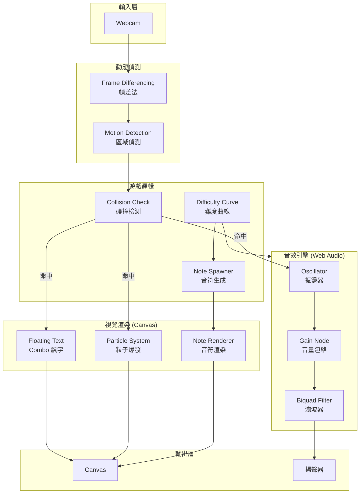
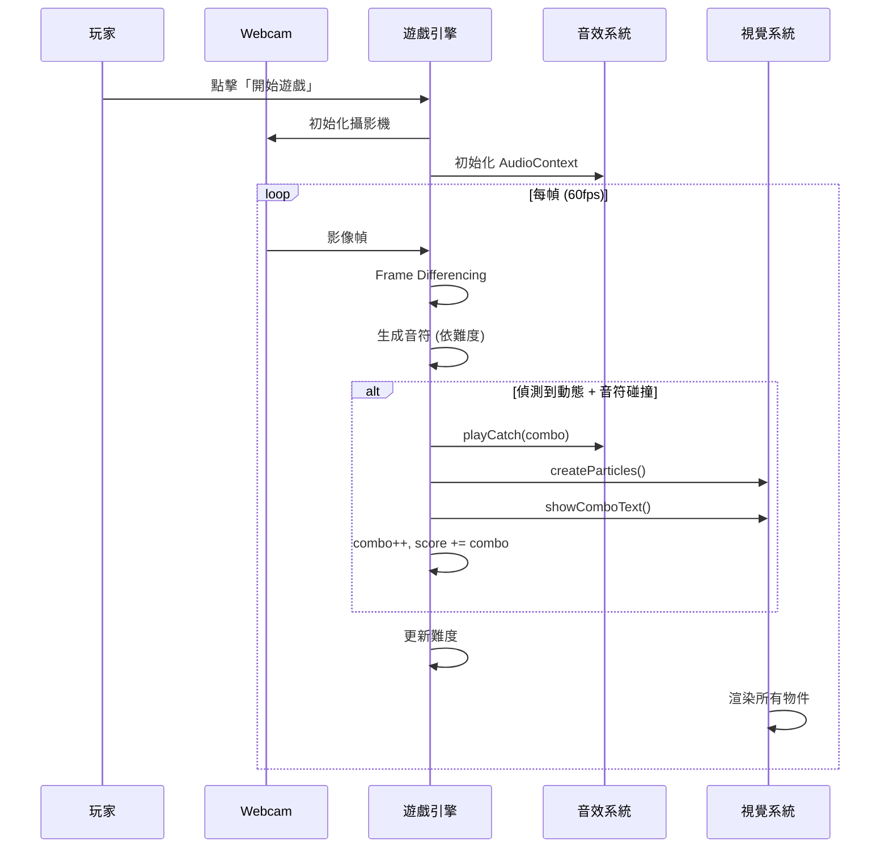
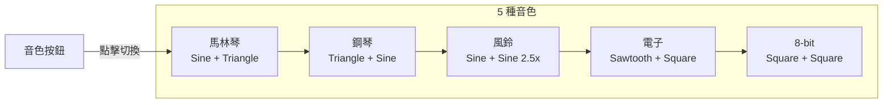
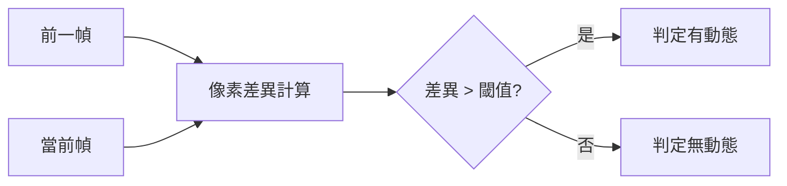

# AR Rhythm Catcher

[](https://opensource.org/licenses/MIT)
[](https://tznthou.github.io/day-10-rhythm-catcher/)
[](https://developer.mozilla.org/en-US/docs/Web/API/Canvas_API)
[](https://developer.mozilla.org/en-US/docs/Web/API/Web_Audio_API)
[](https://fontawesome.com/)

> 體感節奏捕捉遊戲 — 揮動你的手，捕捉發光的音符

[← 回到 Muripo HQ](https://tznthou.github.io/muripo-hq/)

---

## TL;DR

對著 Webcam 揮手，捕捉從畫面上方落下的發光音符。每次成功捕捉都會觸發動態音效與粒子爆發效果。連續捕捉獲得 Combo 加成，難度會隨時間遞增。

---

## 系統架構



---

## 遊戲流程



---

## Quick Start

```bash
# 用任何 HTTP 伺服器開啟
npx live-server
# 或
python -m http.server 8000
```

開啟瀏覽器 → 點擊「開始遊戲」→ 授予攝影機權限 → 揮手捕捉音符！

> **Note**
> 需要 HTTPS 或 localhost 才能存取 Webcam

---

## 功能特色

| 功能 | 說明 |
|------|------|
| **體感偵測** | 透過 Webcam 即時偵測畫面中的動態變化 |
| **5 種音色** | 馬林琴、鋼琴、風鈴、電子、8-bit 可自由切換 |
| **漸進難度** | 音符下落速度與生成頻率隨時間遞增 |
| **Combo 系統** | 連續捕捉獲得加乘分數與視覺強化 |
| **粒子特效** | 根據 Combo 數動態調整爆炸粒子數量與大小 |
| **暫停功能** | 支援 ESC / 空白鍵暫停與繼續 |

---

## 音色預設



| 音色 | 主振盪器 | 副振盪器 | 泛音比 | 特效 |
|------|---------|---------|--------|------|
| **馬林琴** | Sine | Triangle | 2x (八度) | 無 |
| **鋼琴** | Triangle | Sine | 3x (五度) | Reverb |
| **風鈴** | Sine | Sine | 2.5x | Reverb |
| **電子** | Sawtooth | Square | 1x | Filter Sweep |
| **8-bit** | Square | Square | 2x | 無 |

所有音色使用 **C Major 7 和弦**（C4, E4, G4, B4）隨機選音，根音與五度音有較高的權重。

---

## 技術架構

| 層面 | 技術 | 用途 |
|------|------|------|
| 渲染 | HTML5 Canvas API | 遊戲畫面繪製 |
| 音效 | Web Audio API | 音符合成、音量包絡 |
| 影像 | MediaDevices API | Webcam 存取 |
| 樣式 | CSS3 | UI 元件、Backdrop Filter |
| 字型 | Google Fonts (Orbitron) | 科技感字體 |
| 圖示 | Font Awesome 6.5.1 | 按鈕圖示 |

### 安全措施

- **隱私安全**：影像僅在本地處理，不錄影、不上傳
- **權限處理**：區分 `NotAllowedError` / `NotFoundError` 錯誤類型

---

## 專案結構

```
day-10-rhythm-catcher/
├── index.html          # HTML 結構
├── style.css           # 樣式表
├── README.md           # 說明文件
└── src/
    ├── main.js         # Game 類別、遊戲迴圈
    ├── config.js       # 參數設定
    ├── webcam.js       # Webcam + Frame Differencing
    ├── note.js         # 音符渲染（發光、軌跡）
    ├── particle.js     # 粒子爆發效果
    ├── floatingText.js # Combo 飄字
    └── audio.js        # Web Audio 音效引擎
```

---

## 核心機制

### Frame Differencing 動態偵測



本專案使用 **Frame Differencing** 技術偵測畫面中的動態變化：

1. 將 Webcam 影像縮小至 160x120 解析度以提升效能
2. 比較當前幀與前一幀的像素差異
3. 若差異值超過閾值（threshold: 30），判定為有動態

**優點**：不需預先建立背景模型、對光線變化容忍度高、計算量低。

### Combo Juice System

| Combo | 粒子數量 | 大小倍率 | 螢幕閃光 |
|-------|---------|---------|---------|
| 1-2   | 12      | 1.0x    | 無 |
| 3-5   | 20      | 1.2x    | 無 |
| 6-9   | 30      | 1.5x    | 微弱 |
| 10+   | 40      | 2.0x    | 強烈 |

### Difficulty Progression

難度每 10 秒自動提升：

| 參數 | 初始值 | 最終值 | 說明 |
|------|--------|--------|------|
| 下落速度 | 2 px/frame | 8 px/frame | 音符下落更快 |
| 生成間隔 | 1500 ms | 400 ms | 音符生成更密集 |
| 音效 Attack | 100% | 50% | 音符起音更短促 |
| 音效 Decay | 100% | 40% | 音符消音更快 |
| 音高 | 100% | 110% | 略微提高音調 |

---

## 可調參數

所有參數都集中在 `src/config.js`：

### 難度參數

| 參數 | 預設值 | 說明 |
|------|--------|------|
| `initialSpeed` | 2 | 初始下落速度 (px/frame) |
| `maxSpeed` | 8 | 速度上限 |
| `initialSpawnRate` | 1500 | 初始生成間隔 (ms) |
| `minSpawnRate` | 400 | 最快生成間隔 |
| `difficultyInterval` | 10000 | 難度提升間隔 (ms) |

### 動態偵測參數

| 參數 | 預設值 | 說明 |
|------|--------|------|
| `detectionWidth` | 160 | 偵測解析度寬度 |
| `detectionHeight` | 120 | 偵測解析度高度 |
| `threshold` | 30 | 像素變化閾值 |
| `sampleSize` | 20 | 取樣區塊大小 |

---

## 瀏覽器支援

需要支援以下 API：
- Canvas API
- Web Audio API
- MediaDevices.getUserMedia()
- HTTPS 或 localhost

| 瀏覽器 | 支援 |
|--------|------|
| Chrome 74+ | ✅ |
| Firefox 76+ | ✅ |
| Safari 14.1+ | ✅ |
| Edge 79+ | ✅ |

---

## 創作後記

這個作品試圖把「節奏遊戲」和「體感偵測」結合在一起。Frame Differencing 雖然簡單，但在適當的光線環境下效果意外地好。Web Audio API 的合成器讓音效有了更多可能性，5 種音色各有特色。

做完之後回頭看，這個專案好像有點「水果忍者」的味道——揮手切東西的體感互動。不過太像水果忍者又有抄襲的疑慮，也許之後可以思考其他衍生的可能性：

- **多人對戰**：分割畫面，比較誰接得多（納入日後創作目標）
- **節奏譜面**：預設音符掉落時機，變成真正的節奏遊戲

總之，這是一個起點，不是終點。

---

## License

[](https://opensource.org/licenses/MIT)

This project is licensed under the [MIT License](LICENSE).
