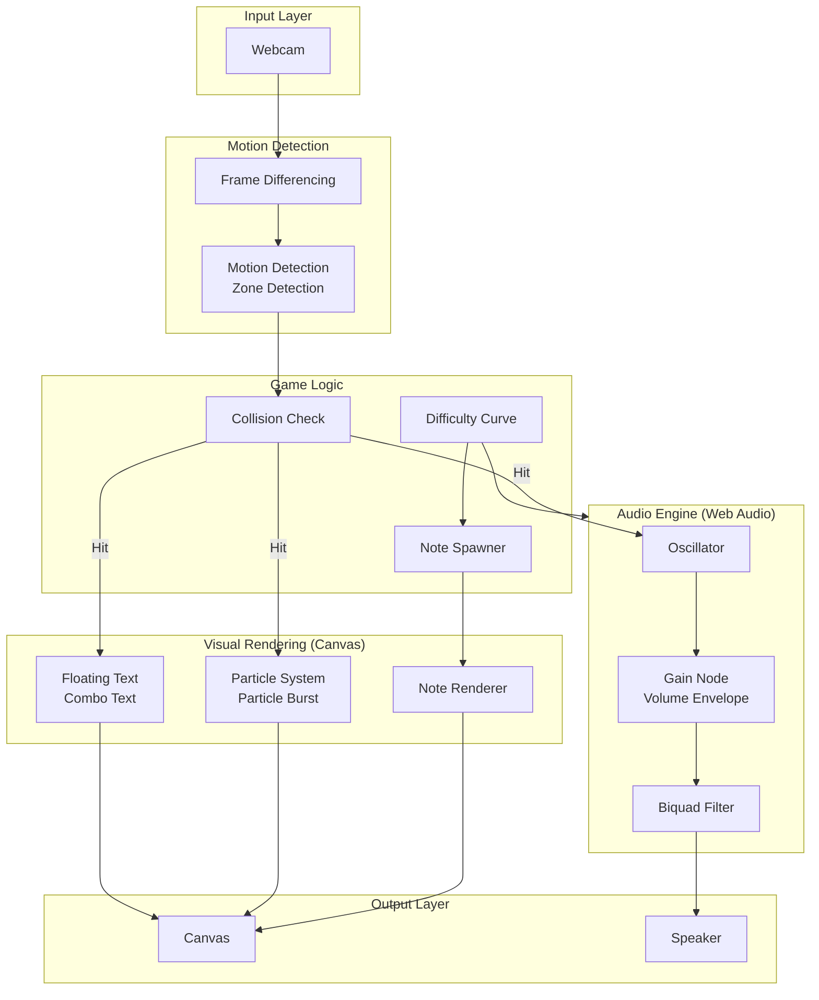
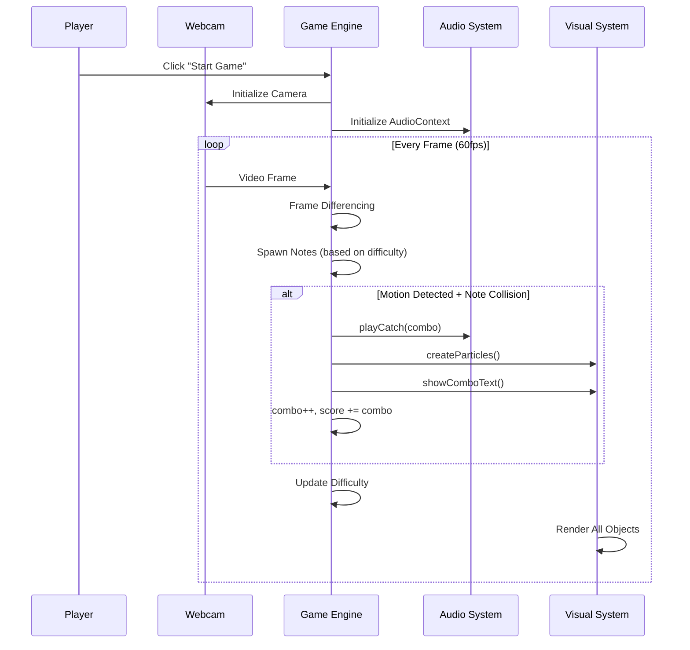
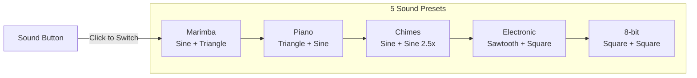
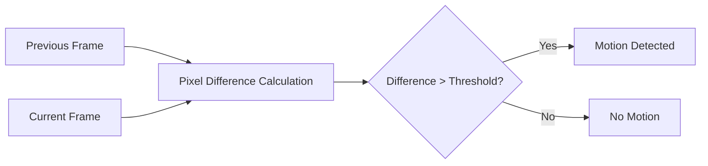

# Rhythm Catcher - Motion-Sensing Rhythm Game

[](https://opensource.org/licenses/MIT)
[](https://tznthou.github.io/day-10-rhythm-catcher/)
[](https://developer.mozilla.org/en-US/docs/Web/API/Canvas_API)
[](https://developer.mozilla.org/en-US/docs/Web/API/Web_Audio_API)
[](https://fontawesome.com/)

> Motion-sensing rhythm catch game — Wave your hands and catch the glowing notes

[← Back to Muripo HQ](https://tznthou.github.io/muripo-hq/) | [中文](README.md)

---

## TL;DR

Wave your hands in front of the webcam to catch glowing notes falling from the top of the screen. Each successful catch triggers dynamic sound effects and particle burst effects. Consecutive catches earn Combo bonuses, and difficulty increases over time.

---

## System Architecture



---

## Game Flow



---

## Quick Start

```bash
# Open with any HTTP server
npx live-server
# or
python -m http.server 8000
```

Open browser → Click "Start Game" → Grant camera permission → Wave to catch notes!

> **Note**
> Requires HTTPS or localhost to access Webcam

---

## Features

| Feature | Description |
|---------|-------------|
| **Motion Sensing** | Real-time detection of motion changes in the video through Webcam |
| **5 Sound Presets** | Marimba, Piano, Chimes, Electronic, 8-bit — freely switchable |
| **Progressive Difficulty** | Note fall speed and spawn rate increase over time |
| **Combo System** | Consecutive catches earn multiplied scores and enhanced visuals |
| **Particle Effects** | Explosion particle count and size dynamically adjust based on Combo |
| **Pause Function** | Supports ESC / Spacebar to pause and resume |

---

## Sound Presets



| Preset | Main Oscillator | Sub Oscillator | Harmonic Ratio | Effect |
|--------|----------------|----------------|----------------|--------|
| **Marimba** | Sine | Triangle | 2x (Octave) | None |
| **Piano** | Triangle | Sine | 3x (Fifth) | Reverb |
| **Chimes** | Sine | Sine | 2.5x | Reverb |
| **Electronic** | Sawtooth | Square | 1x | Filter Sweep |
| **8-bit** | Square | Square | 2x | None |

All presets use **C Major 7 chord** (C4, E4, G4, B4) with random note selection, with root and fifth notes having higher weights.

---

## Technical Architecture

| Layer | Technology | Purpose |
|-------|------------|---------|
| Rendering | HTML5 Canvas API | Game screen drawing |
| Audio | Web Audio API | Note synthesis, volume envelope |
| Video | MediaDevices API | Webcam access |
| Styling | CSS3 | UI components, Backdrop Filter |
| Font | Google Fonts (Orbitron) | Tech-style font |
| Icons | Font Awesome 6.5.1 | Button icons |

### Security Measures

- **Privacy Safe**: Video is processed locally only, no recording, no uploading
- **Permission Handling**: Distinguishes `NotAllowedError` / `NotFoundError` error types

---

## Project Structure

```
day-10-rhythm-catcher/
├── index.html          # HTML structure
├── style.css           # Stylesheet
├── README.md           # Documentation
└── src/
    ├── main.js         # Game class, game loop
    ├── config.js       # Parameter configuration
    ├── webcam.js       # Webcam + Frame Differencing
    ├── note.js         # Note rendering (glow, trail)
    ├── particle.js     # Particle burst effect
    ├── floatingText.js # Combo floating text
    └── audio.js        # Web Audio sound engine
```

---

## Core Mechanisms

### Frame Differencing Motion Detection



This project uses **Frame Differencing** technique to detect motion changes in the video:

1. Downscale Webcam image to 160x120 resolution for performance
2. Compare pixel differences between current frame and previous frame
3. If difference exceeds threshold (threshold: 30), motion is detected

**Advantages**: No need to pre-establish background model, tolerant to lighting changes, low computational cost.

### Combo Juice System

| Combo | Particle Count | Size Multiplier | Screen Flash |
|-------|---------------|-----------------|--------------|
| 1-2   | 12            | 1.0x            | None |
| 3-5   | 20            | 1.2x            | None |
| 6-9   | 30            | 1.5x            | Subtle |
| 10+   | 40            | 2.0x            | Strong |

### Difficulty Progression

Difficulty automatically increases every 10 seconds:

| Parameter | Initial | Final | Description |
|-----------|---------|-------|-------------|
| Fall Speed | 2 px/frame | 8 px/frame | Notes fall faster |
| Spawn Interval | 1500 ms | 400 ms | Notes spawn more frequently |
| Audio Attack | 100% | 50% | Shorter note attack |
| Audio Decay | 100% | 40% | Faster note decay |
| Pitch | 100% | 110% | Slightly higher pitch |

---

## Configurable Parameters

All parameters are centralized in `src/config.js`:

### Difficulty Parameters

| Parameter | Default | Description |
|-----------|---------|-------------|
| `initialSpeed` | 2 | Initial fall speed (px/frame) |
| `maxSpeed` | 8 | Maximum speed |
| `initialSpawnRate` | 1500 | Initial spawn interval (ms) |
| `minSpawnRate` | 400 | Minimum spawn interval |
| `difficultyInterval` | 10000 | Difficulty increase interval (ms) |

### Motion Detection Parameters

| Parameter | Default | Description |
|-----------|---------|-------------|
| `detectionWidth` | 160 | Detection resolution width |
| `detectionHeight` | 120 | Detection resolution height |
| `threshold` | 30 | Pixel change threshold |
| `sampleSize` | 20 | Sampling block size |

---

## Browser Support

Requires support for the following APIs:
- Canvas API
- Web Audio API
- MediaDevices.getUserMedia()
- HTTPS or localhost

| Browser | Support |
|---------|---------|
| Chrome 74+ | ✅ |
| Firefox 76+ | ✅ |
| Safari 14.1+ | ✅ |
| Edge 79+ | ✅ |

---

## Afterword

This project attempts to combine "rhythm game" with "motion sensing." While Frame Differencing is simple, it works surprisingly well in proper lighting conditions. The Web Audio API synthesizer opens up more possibilities for sound effects, with each of the 5 presets having its own character.

Looking back after completion, this project seems to have a "Fruit Ninja" vibe — the motion-sensing interaction of waving to slice things. However, being too similar to Fruit Ninja raises concerns about imitation. Perhaps I should think about other derivative possibilities in the future:

- **Multiplayer Battle**: Split screen, compete to see who catches more (added to future creation goals)
- **Rhythm Chart**: Preset note fall timings, becoming a true rhythm game

In any case, this is a starting point, not an endpoint.

---

## License

[](https://opensource.org/licenses/MIT)

This project is licensed under the [MIT License](LICENSE).

---

## Author

Tzu-Chao - [tznthou@gmail.com](mailto:tznthou@gmail.com)
